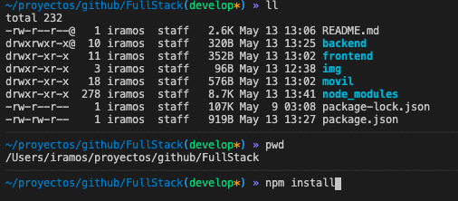
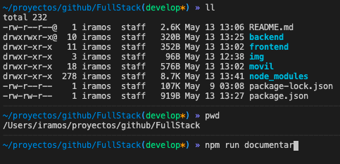
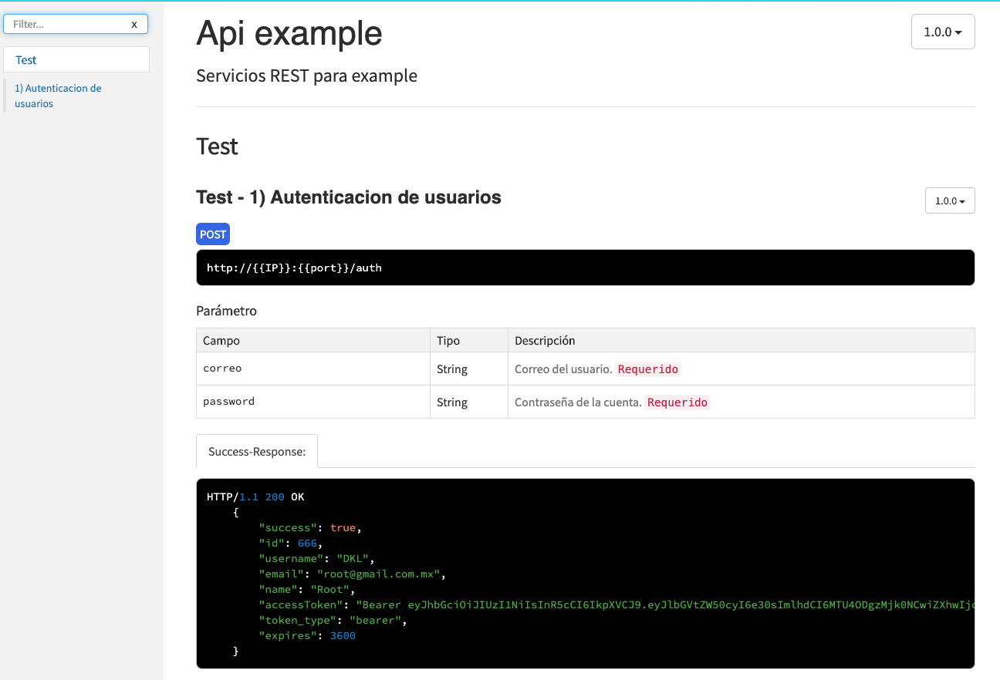
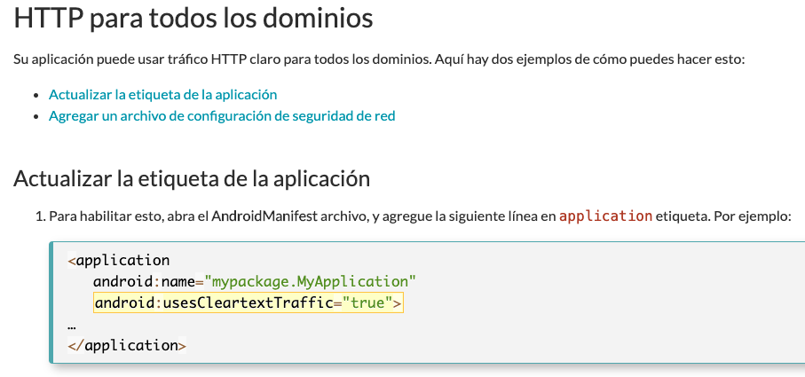

# Proyecto Full stack.

# Tecnología del lado del ```(Back End)```.
* ``` nodejs ``` --> [Install](https://nodejs.org/en/)

* ``` express ``` --> [Install](https://expressjs.com/en/starter/installing.html)

* ``` mongodb ``` ---> [Install](https://www.mongodb.com/download-center/community)

# Referencía

Comparto la coleccion de postman para los end point.

* [Coleccion end point postman]( https://www.getpostman.com/collections/e34398c2e2c2ac033fca).


1.  Para instalar las dependencia del proyecto se  tiene que ubicar en la raiz del proyecto estando allí ejecuta.

    ``` 
    npm install 
    ```
    

 2. Para realizar la documentación de la api se instalo [apidoc](https://apidocjs.com/). Iniciar servicio ejecuta el siguiente comando en la misma direccion donde se ejecuto el anterior comando. ```[Este punto esta incompleto, falta documentar la api completa]```.

    

3. Para visualizarlo en la web ejecuta. 

    ``` 
    http://localhost:3000/apidoc/
    ```

     


4.  Iniciar el servicio del server.

    ``` 
    npm start 
    ```

5. El servidor se encuentra escuchando peticiones de manera local en:

    ``` 
    http://localhost:3000/ 

    ```

# Tecnología del lado del ```(Front End Web)```.

* ``` Angular 9.1.3``` ---> [Install](https://cli.angular.io/)

* ``` Typescript ``` ---> [Install](https://www.typescriptlang.org/#download-links)

# Referencía

1. Para instalar las dependencias del proyecto, se ubica dentro de la carpeta de 
```(frontend)``` y se ejecuta el comando:

    ``` 
    npm install 
    ```

2.  Iniciar el servicio del server.

    ``` 
    ng serve -o 
    ```

3. El servidor se encuentra corriendo de manera local en:

    ``` 
    http://localhost:4200/registro 
    ```

# Tecnología para desarrollo ```(Móvil)```.

* ``` Nativescript``` ---> [Install](https://docs.nativescript.org/angular/start/quick-setup)

    En mi caso particular tube problemas para instalar nativescript. La manera que me funciono fue:

    ``` 
    sudo npm install nativescript -g --unsafe-perm 
    ```

1. Para la instalar las dependencías al proyecto, tiene que estar dentro de la carpeta de ```(movil)```. Y ejecutar:

    ``` 
    npm install 
    ```
    
2. Una vez creado se podria compilar para verificar que sea creado correctamente.

    ``` 
    tns buil android --bundle 
    ```

3. Comando para ejecutarlo en un simulador o en un dispositivo fisico de android.

     ``` 
     tns run android --bundle 
     ```
    
4. Un detalle a tomar en cuenta para trabajar de manera local con android pie.

    * [Leer documento sobre seguridad en android pie](https://support.brightcove.com/es/android-pie-support-native-sdk-android)


    En mi caso no podria realizar ningun request remoto ya que no me lo permitia el mismo android. Y tube que agregar estar linea para ```(HTTP para todos los dominios)```. Se agrega al AndroidManifest.xml ubicado en: ```(App_Resources/Android/src/main/AndroidManifest.xml)```

      
